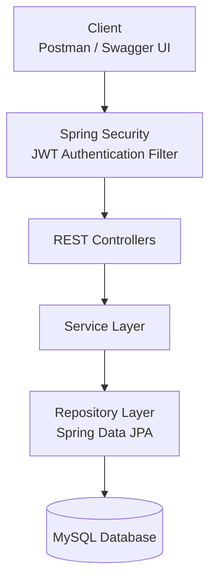

# 🎬 CineBase

CineBase is a secure and scalable **Movie Management REST API** built with **Spring Boot**. It provides JWT-based authentication, role-based authorization, movie management, user reviews, and personalized movie lists while following a clean layered architecture.

The project was built to practice backend development using modern Java technologies and REST API design principles.

---

# 🚀 Features

## Authentication & Authorization

* User Registration
* User Login
* JWT Authentication
* Role-Based Access Control (Admin/User)
* Password Encryption using BCrypt
* Stateless Authentication with Spring Security

## Movie Management

* Add, Update and Delete Movies (Admin)
* Retrieve All Movies
* Get Movie Details by ID
* Search Movies by Title
* Filter Movies by Genre

## Reviews

* Add Reviews
* Update Reviews
* Delete Reviews
* View Reviews for a Movie

## Personal Movie Lists

Users can organize movies into different categories:

* Watchlist
* Watch History
* Favorites

Supported operations:

* Add Movie
* Remove Movie
* View Personal Lists

## API Documentation

* Interactive Swagger UI
* OpenAPI Specification

## Containerization

* Docker Support
* Docker Compose Support

---

# 🛠️ Tech Stack

| Category          | Technologies                |
| ----------------- | --------------------------- |
| Language          | Java 21                     |
| Framework         | Spring Boot                 |
| Security          | Spring Security, JWT        |
| ORM               | Spring Data JPA (Hibernate) |
| Database          | MySQL                       |
| Build Tool        | Maven                       |
| API Documentation | Swagger / OpenAPI           |
| Containerization  | Docker, Docker Compose      |
| Version Control   | Git & GitHub                |

---

# 📂 Project Structure

```text
src
├── controller
├── service
│   ├── interface
│   └── implementation
├── repository
├── entity
├── dto
│   ├── request
│   └── response
├── config
├── security
├── exception
├── enums
└── util
```

---

# 🏗️ Architecture



The project follows a **Layered Architecture**, where each layer has a single responsibility.

| Layer      | Responsibility                                     |
| ---------- | -------------------------------------------------- |
| Controller | Receives HTTP requests and returns responses       |
| Security   | Authenticates users and validates JWT tokens       |
| Service    | Implements business logic                          |
| Repository | Performs database operations using Spring Data JPA |
| Database   | Stores application data in MySQL                   |

---

# 🗃️ Database Design

The following Entity Relationship Diagram illustrates the database schema used by CineBase.

<p align="center">


</p>

---

# 🔐 Authentication Flow

1. User logs in with email and password.
2. Spring Security authenticates the credentials.
3. A JWT token is generated upon successful authentication.
4. The client includes the JWT token in subsequent requests.
5. The JWT Authentication Filter validates the token before granting access to protected endpoints.

---

# 📦 API Documentation

After starting the application, Swagger UI can be accessed at:

```text
http://localhost:8080/swagger-ui/index.html
```

OpenAPI JSON Specification:

```text
http://localhost:8080/v3/api-docs
```

---

# ⚙️ Getting Started

## Prerequisites

Before running the project, ensure you have:

* Java 21
* Maven
* MySQL
* Docker (Optional)

---

## Clone the Repository

```bash
git clone https://github.com/AkramShaik2903/cinebase.git

cd cinebase
```

---

## Configure the Database

Update your environment variables or `application.properties`.

```properties
SPRING_DATASOURCE_URL=jdbc:mysql://localhost:3306/cinebase
SPRING_DATASOURCE_USERNAME=root
SPRING_DATASOURCE_PASSWORD=your_password

JWT_SECRET=your-secret-key
```

---

## Build and Run

### Using Maven

```bash
mvn clean install

mvn spring-boot:run
```

### Using Docker

```bash
docker compose up --build
```

---

# 📸 Screenshots

## Swagger UI


## Docker Containers


# 📖 API Modules

| Module         | Base Endpoint              |
| -------------- | -------------------------- |
| Authentication | `/api/auth/**`             |
| Movies         | `/api/movies/**`           |
| Reviews        | `/api/reviews/**`          |
| Watchlist      | `/api/me/watchlist/**`     |
| Watch History  | `/api/me/watch-history/**` |
| Favorites      | `/api/me/favorites/**`     |

---

# 📌 Future Improvements

Some features planned for future releases:

* Movie Recommendation System
* Director, Cast and Production Company Management
* OTT Platform Information
* Email Verification
* Forgot Password / Password Reset
* Poster & Trailer Upload
* Redis Caching
* Pagination & Sorting
* CI/CD Pipeline
* Unit & Integration Testing
* Microservices Architecture

---

# 👨‍💻 Author

**Akram Shaik**

Java Backend Developer | Spring Boot | REST APIs 

**GitHub**

```
https://github.com/AkramShaik2903
```

**LinkedIn**

```
https://linkedin.com/in/akram-shaik-323bab246/
```

---

# 📄 License

This project is intended for learning, portfolio, and educational purposes.
