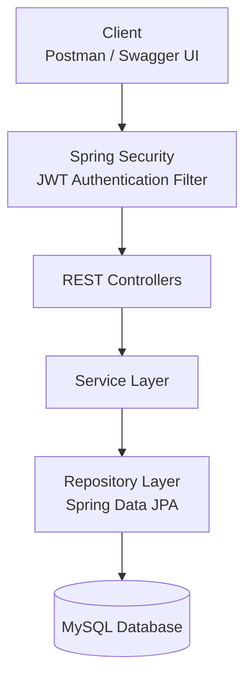

# 🎬 CineBase

**CineBase** is a secure and scalable Movie Management REST API built with **Spring Boot**. It provides user authentication with JWT, role-based authorization, movie management, reviews, and watchlists while following a clean layered architecture.

---

## 🚀 Features

### Authentication & Authorization

* User Registration
* User Login
* JWT Authentication
* Role-Based Access Control (Admin/User)
* Password Encryption using BCrypt
* Stateless Authentication with Spring Security

### Movie Management

* Add Movies (Admin)
* Update Movies (Admin)
* Delete Movies (Admin)
* Get All Movies
* Get Movie by ID
* Filter Movies by Genre, Language, Rating, etc.

### Reviews

* Add Review
* Update Review
* Delete Review
* View Reviews for a Movie

### Watchlist

* Add Movie to Watchlist
* Remove Movie from Watchlist
* View User Watchlist

### API Documentation

* Swagger / OpenAPI Integration

### Containerization

* Docker Support
* Docker Compose Support

---

# 🛠️ Tech Stack

| Category         | Technologies                |
| ---------------- | --------------------------- |
| Language         | Java 21                     |
| Framework        | Spring Boot                 |
| Security         | Spring Security, JWT        |
| ORM              | Spring Data JPA (Hibernate) |
| Database         | MySQL                       |
| Build Tool       | Maven                       |
| Documentation    | Swagger / OpenAPI           |
| Containerization | Docker, Docker Compose      |
| Version Control  | Git & GitHub                |

---

# 📂 Project Structure

```text
src
├── controller
├── service
│   ├── interface
│   └── implementation
├── repository
├── entity
├── dto
├── config
├── security
├── exception
└── util
```

---

# 🏗️ Architecture



The project follows a **Layered Architecture**, where each layer has a specific responsibility:

* **Controller Layer** – Handles incoming HTTP requests and returns responses.
* **Service Layer** – Contains the business logic.
* **Repository Layer** – Communicates with the database using Spring Data JPA.
* **Security Layer** – Validates JWT tokens and authorizes users.
* **Database Layer** – Stores application data in MySQL.

---

# 🗃️ Database Design

> **ER Diagram**

*Add the ER diagram image here.*

```text
docs/images/er-diagram.png
```

---

# 🔐 Authentication Flow

1. User logs in using email and password.
2. Credentials are authenticated by Spring Security.
3. A JWT token is generated.
4. The client sends the JWT token with every protected request.
5. The JWT filter validates the token before allowing access to secured APIs.

---

# 📦 API Documentation

Once the application is running:

```
http://localhost:8080/swagger-ui/index.html
```

OpenAPI specification:

```
http://localhost:8080/v3/api-docs
```

---

# ⚙️ Getting Started

## Prerequisites

* Java 21
* Maven
* MySQL
* Docker (Optional)

---

## Clone the Repository

```bash
git clone https://github.com/<your-username>/cinebase.git

cd cinebase
```

---

## Configure Database

Update your environment variables or `application.properties`.

Example:

```properties
SPRING_DATASOURCE_URL=jdbc:mysql://localhost:3306/cinebase
SPRING_DATASOURCE_USERNAME=root
SPRING_DATASOURCE_PASSWORD=your_password

JWT_SECRET=your-secret-key
```

---

## Run Using Maven

```bash
mvn clean install

mvn spring-boot:run
```

---

## Run Using Docker

```bash
docker compose up --build
```

---

# 📸 Screenshots

### Swagger UI

*Add screenshot here.*

```
docs/images/swagger-ui.png
```

---

### Docker Containers

*Add Docker screenshot here.*

```
docs/images/docker.png
```

---

# 📖 API Endpoints

| Module         | Endpoint            |
| -------------- | ------------------- |
| Authentication | `/api/auth/**`      |
| Movies         | `/api/movies/**`    |
| Reviews        | `/api/reviews/**`   |
| Watchlist      | `/api/watchlist/**` |

---

# 📌 Future Improvements

* Search with pagination
* Movie recommendations
* Favorites
* Email verification
* Password reset
* Image upload
* Caching with Redis
* CI/CD Pipeline
* Microservices architecture

---

# 👨‍💻 Author

**Akram Shaik**

Backend Developer | Java | Spring Boot | REST APIs

GitHub:

```
https://github.com/<your-username>
```

LinkedIn:

```
https://linkedin.com/in/<your-profile>
```

---

# 📄 License

This project is developed for learning, portfolio, and educational purposes.
